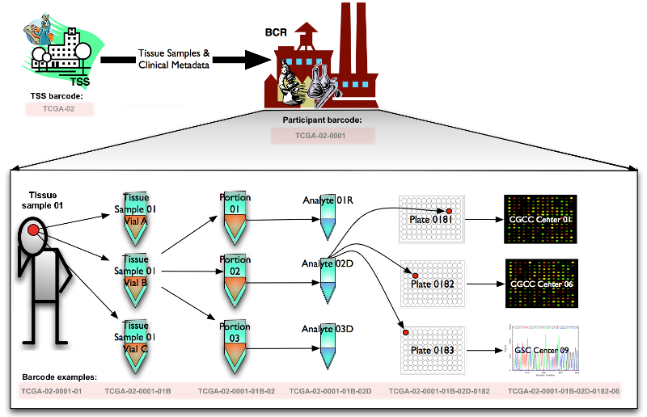
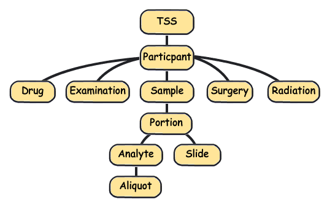

# TCGA

## Get Data

All data and code can be retrieved from https://github.com/c1au6i0/tcga_metadata.

Download Biospecimen and Clinical data (in `csv`) from the [TCGA-PRAD website](https://portal.gdc.cancer.gov/projects/TCGA-PRAD) in `data` folder.

Info on the ids can be found [here](https://docs.cancergenomicscloud.org/docs/tcga-metadata#section-case)

And some below useful pics from TCGA website.

Barcodes:



And the hierarchy:



## Clinical Info

This is to untar, import and clean up the clinical info.

```{r message=FALSE, warning=FALSE}
library(here)
library(tidyverse)

untar(here("data", "dna_whole", "clinical.project-TCGA-PRAD.2020-11-20.tar.gz"), exdir = here("data", "dna_whole", "clinical")) 


to_imp <- list.files(here("data", "dna_whole", "clinical"), full.names = TRUE)

clinical <- lapply(to_imp, read.delim)
names(clinical) <- sub("\\.tsv", "", list.files(here("data", "dna_whole", "clinical")))

clean_data <- function(dat){
  dat[dat == "Not Reported"| dat == "'--"] <- NA
  # dat[dat == "'--"] <- NA
  dat %>% 
     select(where(~!all(is.na(.))))
}
```

Only one of the files has not empty columns. Family history and exposure are empty...
This a list of the **metadata files relative to clinical data** and their identifiers.

```{r}
clinical <- lapply(clinical, clean_data)

lapply(clinical, names)
```

## Biospecimen Info

This is to untar, import and clean up the biospecimen info.

```{r}
untar(here("data", "dna_whole", "biospecimen.project-TCGA-PRAD.2020-11-19.tar.gz"), exdir = here("data", "dna_whole", "biospecimen")) 

to_imp <- list.files(here("data", "dna_whole", "biospecimen"), full.names = TRUE)

biospecimen <- lapply(to_imp, read.delim)
names(biospecimen) <- sub("\\.tsv", "", list.files(here("data", "dna_whole", "biospecimen")))
```

This a list of the **metadata files relative to biospeciments** and their identifiers.

```{r}
biospecimen <- lapply(biospecimen, clean_data)

lapply(biospecimen, names)

# IDS shared among datasets
ids <- Reduce(intersect, lapply(biospecimen, names))

all_bios <- plyr::join_all(biospecimen, by = ids, type = "full")
```

## Single Flat File

We create a single file with all info and recode the analyte types based on the [codes](https://gdc.cancer.gov/resources-tcga-users/tcga-code-tables/portion-analyte-codes).

```{r message=FALSE}
# IDS shared among datasets
ids_2 <- Reduce(intersect, lapply(list(clinical$clinical, all_bios), names))

all_ann <- full_join(clinical$clinical, all_bios, by = ids_2) 

all_ann <- all_ann %>% 
  mutate(analyte_type_id = recode(analyte_type_id,
    "W" = "Whole Genome Amplification",
    "D" = "DNA",
    "H" = "mirVana RNA",
    "R" = "RNA",
    "T" = "total RNA",
    "x" = "Whole Genome Amplification second reaction"
  ))
```


Number of patients:

```{r}
length(unique(all_ann$case_submitter_id))
```

# ICGC

List of Whole Genome Samples can be found [here](https://dcc.icgc.org/repositories?filters=%7B%22file%22:%7B%22projectCode%22:%7B%22is%22:%5B%22PRAD-US%22%5D%7D,%22primarySite%22:%7B%22is%22:%5B%22Prostate%22%5D%7D,%22study%22:%7B%22is%22:%5B%22PCAWG%22%5D%7D,%22experimentalStrategy%22:%7B%22is%22:%5B%22WGS%22%5D%7D,%22fileFormat%22:%7B%22is%22:%5B%22BAM%22%5D%7D%7D%7D&files=%7B%22from%22:1,%22size%22:25%7D).


These are the ids.
Go to https://dcc.icgc.org/analysis/sets, save donor set, download donor set and check clinical data.

```{r}
donors <- list(
  "TCGA-CH-5763",
  "TCGA-EJ-5506",
  "TCGA-HI-7169",
  "TCGA-CH-5788",
  "TCGA-EJ-5503",
  
  "TCGA-HC-8258",
  "TCGA-HC-7233",
  "TCGA-G9-6336",
  "TCGA-HC-7079",
  "TCGA-EJ-7791",
  
  "TCGA-HC-7737",
  "TCGA-CH-5771",
  "TCGA-G9-7522",
  "TCGA-CH-5789",
  "TCGA-HC-7744",
  
  "TCGA-G9-6370",
  "TCGA-G9-6365",
  "TCGA-HC-7740",
  "TCGA-HC-7075",
  "TCGA-CH-5750"
)
```

```{r}
whole_genome_samples <- clinical$clinical %>% 
  filter(case_submitter_id %in% !!donors) %>% 
  pivot_wider(names_from = "treatment_type", values_from = "treatment_or_therapy")
```

Number of patients:

```{r}
length(unique(whole_genome_samples$case_submitter_id))
```


```{r echo=FALSE}
write.csv(whole_genome_samples, file = here("reports", "whole_genome_samples.csv"))
write.csv(all_ann, file = here("reports", "all_tcga_prostate.csv"))

# tar(tarfile = here("reports", "aggregate_metadata.tar"),
#     files = c(here("reports", "whole_genome_samples.csv"),
#               here("reports", "all_tcga_prostate.csv")
#               ),
#     compression = "gzip",
#     extra_flags = "Ccvf"
#     )


unlink(here("data", "dna_whole", "clinical"), recursive = TRUE)
unlink(here("data", "dna_whole", "biospecimen"), recursive = TRUE)

# unlink(
#        grep("csv", dir(here("reports"), full.names = TRUE), value = TRUE)
# )
```


```{r}
whole_genome_samples %>% 
  mutate(across(where(is.character), as.factor)) %>% 
  skimr::skim()
```
```{r}
all_ann %>% 
  mutate(across(where(is.character), as.factor)) %>% 
  skimr::skim()
View(all_ann)
```


```{r}
ICGC_ids <- read.delim(here::here("data", "dna_whole", "ICGC_donors.tsv"))

dput(unique(ICGC_ids$ICGC.Donor))

```


